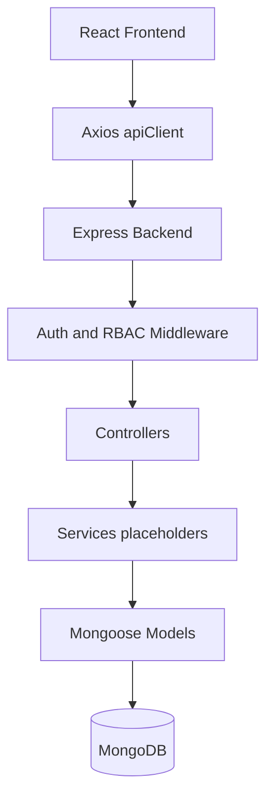

# TransitOps

Smart Transport Operations Platform

TransitOps is a full-stack transport and fleet management system built for hackathon evaluation. The repository currently contains a polished React frontend, a TypeScript/Express/Mongoose backend foundation, seeded MongoDB models, JWT login, role-aware navigation, and placeholder CRUD routes ready for future controller implementation.

## Badges

[](#license)
[](https://react.dev/)
[](https://www.typescriptlang.org/)
[](https://expressjs.com/)
[](https://www.mongodb.com/)
[](#project-overview)
[](#installation)
[](add-your-github-repository-url-here)

## Project Overview

### Problem Statement

Fleet operators often manage vehicles, drivers, dispatches, maintenance, fuel, and expenses across separate tools. That creates inconsistent status tracking, weak auditability, and slow operational decisions.

### Solution

TransitOps consolidates fleet operations into a single dashboard with a protected application shell, role-based navigation, operational pages, analytics, and seeded demo accounts for fast evaluation. The frontend provides the user experience and local operational workflows, while the backend provides authentication, MongoDB models, validation scaffolding, RBAC middleware, and API endpoints for future CRUD expansion.

### Target Users

The application is designed for Fleet Managers, Dispatchers, Safety Officers, and Financial Analysts.

## Features

| Feature           |         Current State | Notes                                                                                                                 |
| ----------------- | --------------------: | --------------------------------------------------------------------------------------------------------------------- |
| Authentication    |           Implemented | JWT login is wired through the backend auth route and frontend auth context. Demo accounts are seeded for evaluation. |
| Fleet Management  |           Implemented | Vehicle registry page supports add, edit, delete, filtering, sorting, and status badges.                              |
| Driver Management |           Implemented | Driver page supports filters, safety/compliance checks, and CRUD-style UI flows.                                      |
| Trip Management   |           Implemented | Trip dispatcher supports create, dispatch, complete, cancel, filtering, and live validation.                          |
| Maintenance       |           Implemented | Maintenance module tracks service records and synchronizes vehicle availability in the UI state layer.                |
| Fuel Management   |           Implemented | Fuel logs are tracked in the Fuel & Expense module with filters and tables.                                           |
| Expense Tracking  |           Implemented | Operational expense records are available in the Fuel & Expense module.                                               |
| Analytics         |           Implemented | Reports and analytics page provides KPI cards, charts, insights, CSV export, and print layout.                        |
| Reports           | Partially implemented | Report-style export is available from the analytics page; there is no separate reports module.                        |
| RBAC              |           Implemented | Frontend route protection and backend role guard middleware are both present.                                         |
| Settings          |           Implemented | Settings page includes preferences, demo user management, and permission matrix state.                                |
| Dashboard         |           Implemented | Dashboard page shows operational KPIs, vehicle status breakdown, and recent trip summaries.                           |

## Tech Stack

### Frontend

| Layer         | Technology       |
| ------------- | ---------------- |
| Framework     | React 19         |
| Build Tool    | Vite             |
| Language      | TypeScript       |
| Routing       | React Router DOM |
| HTTP Client   | Axios            |
| Forms         | React Hook Form  |
| Validation    | Zod              |
| Charts        | Recharts         |
| Notifications | Sonner           |
| Icons         | Lucide React     |
| Styling       | Tailwind CSS     |

### Backend

| Layer                | Technology           |
| -------------------- | -------------------- |
| Runtime              | Node.js              |
| Framework            | Express              |
| Language             | TypeScript           |
| ODM                  | Mongoose             |
| Authentication       | JSON Web Token       |
| Password Hashing     | bcryptjs             |
| Validation           | Zod                  |
| Security Middleware  | helmet, cors         |
| Logging              | morgan               |
| Cookie Handling      | cookie-parser        |
| Async Error Handling | express-async-errors |

### Database

| Layer            | Technology                                     |
| ---------------- | ---------------------------------------------- |
| Primary Database | MongoDB                                        |
| Connection Layer | Mongoose                                       |
| Seed Data        | Node seed script in `backend/src/seed/seed.ts` |

### Developer Tools

| Tool        | Purpose                               |
| ----------- | ------------------------------------- |
| TypeScript  | Type safety in both apps              |
| ts-node-dev | Backend hot reload during development |
| Oxlint      | Frontend linting                      |
| npm         | Package management                    |

## Architecture



## Project Structure

```text
TransitOps/
├── README.md
├── backend/
│   ├── package.json
│   ├── tsconfig.json
│   ├── .env
│   └── src/
│       ├── app.ts
│       ├── server.ts
│       ├── config/
│       ├── controllers/
│       ├── middleware/
│       ├── models/
│       ├── routes/
│       ├── seed/
│       ├── services/
│       ├── types/
│       ├── utils/
│       └── validators/
└── frontend/
    ├── package.json
    ├── vite.config.ts
    └── src/
        ├── api/
        ├── components/
        ├── context/
        ├── pages/
        └── routes/
```

### Important Folders

| Folder                    | Purpose                                                                                           |
| ------------------------- | ------------------------------------------------------------------------------------------------- |
| `backend/src/config`      | Environment loading and MongoDB connection setup.                                                 |
| `backend/src/controllers` | Current controller layer; most routes return structured placeholder responses while auth is live. |
| `backend/src/middleware`  | JWT authentication, role checks, error handling, and 404 handling.                                |
| `backend/src/models`      | Mongoose schemas for users, vehicles, drivers, trips, maintenance, fuel logs, and expenses.       |
| `backend/src/routes`      | Express route wiring for auth and domain modules.                                                 |
| `backend/src/seed`        | Seed script that clears and repopulates the database.                                             |
| `backend/src/services`    | Empty service classes reserved for future business logic.                                         |
| `backend/src/validators`  | Zod schemas for request validation.                                                               |
| `frontend/src/api`        | Axios client with token injection and 401 handling.                                               |
| `frontend/src/components` | Shared layout and UI primitives.                                                                  |
| `frontend/src/context`    | Application state for auth, fleet, drivers, trips, maintenance, fuel, expenses, and settings.     |
| `frontend/src/pages`      | Feature screens for the dashboard, operational modules, analytics, login, and settings.           |
| `frontend/src/routes`     | Public and protected route definitions.                                                           |

## Installation

### 1. Clone the repository

```bash
git clone <your-github-repository-url>
cd TransitOps
```

### 2. Install frontend dependencies

```bash
cd frontend
npm install
```

### 3. Install backend dependencies

```bash
cd ../backend
npm install
```

### 4. Configure environment variables

Create the `.env` files described below before running either app.

### 5. Run MongoDB

Use MongoDB Atlas or a local MongoDB instance.

### 6. Start the backend

```bash
cd backend
npm run dev
```

### 7. Start the frontend

```bash
cd frontend
npm run dev
```

## Environment Variables

### `backend/.env.example`

```env
PORT=5000
NODE_ENV=development
MONGO_URI=mongodb+srv://<username>:<password>@<cluster>/<database>?retryWrites=true&w=majority
JWT_SECRET=replace-with-a-long-random-secret
```

### `frontend/.env.example`

```env
VITE_API_URL=http://localhost:5000/api
```

### Variable Reference

| Variable       | Where    | Purpose                                                                                       |
| -------------- | -------- | --------------------------------------------------------------------------------------------- |
| `PORT`         | Backend  | Port used by the Express server.                                                              |
| `NODE_ENV`     | Backend  | Runtime mode such as `development` or `production`.                                           |
| `MONGO_URI`    | Backend  | MongoDB connection string used by Mongoose.                                                   |
| `JWT_SECRET`   | Backend  | Secret used to sign and verify login tokens.                                                  |
| `VITE_API_URL` | Frontend | Base URL for the Axios client. If omitted, the app falls back to `http://localhost:5000/api`. |

## Usage

The frontend uses a protected shell with a role-aware sidebar. After login, users are routed to the dashboard and can move through the operational pages from there.

### Login

Use one of the seeded demo accounts after running the backend seed script.

| Email                        | Password     | Role              |
| ---------------------------- | ------------ | ----------------- |
| fleet.manager@transitops.dev | Password@123 | Fleet Manager     |
| dispatcher@transitops.dev    | Password@123 | Dispatcher        |
| safety@transitops.dev        | Password@123 | Safety Officer    |
| finance@transitops.dev       | Password@123 | Financial Analyst |

### Dashboard

Shows high-level fleet KPIs, a vehicle status distribution chart, and recent trip summaries.

### Fleet

Provides the vehicle registry UI with filtering, sorting, and add/edit/delete flows.

### Drivers

Shows driver profiles, license validity indicators, and safety-oriented filters.

### Trips

Provides trip creation, dispatch, completion, cancellation, and live validation checks.

### Maintenance

Tracks maintenance records and UI-driven vehicle availability changes.

### Fuel

The Fuel & Expense module shows fuel logs and operational expenses in separate tabs.

### Analytics

Displays charts, KPI cards, business insights, CSV export, and print-ready report output.

## API Documentation

Current backend behavior is split into two groups:

| Group                 | Behavior                                                                                                      |
| --------------------- | ------------------------------------------------------------------------------------------------------------- |
| Auth endpoints        | Implemented with JWT login and current-user lookup.                                                           |
| Domain CRUD endpoints | Wired and protected, but currently return structured placeholder responses for future controller integration. |

### Authentication

| Method | Route                | Description                                             | Authentication Required |
| ------ | -------------------- | ------------------------------------------------------- | ----------------------- |
| POST   | `/api/auth/login`    | Authenticate a user and return a JWT plus user payload. | No                      |
| POST   | `/api/auth/register` | Placeholder registration endpoint.                      | No                      |
| GET    | `/api/auth/me`       | Return the current authenticated user.                  | Yes                     |

### Vehicles

| Method | Route               | Description                          | Authentication Required |
| ------ | ------------------- | ------------------------------------ | ----------------------- |
| GET    | `/api/vehicles`     | Placeholder vehicle list endpoint.   | Yes                     |
| POST   | `/api/vehicles`     | Placeholder create endpoint.         | Yes                     |
| GET    | `/api/vehicles/:id` | Placeholder vehicle detail endpoint. | Yes                     |
| PATCH  | `/api/vehicles/:id` | Placeholder update endpoint.         | Yes                     |
| DELETE | `/api/vehicles/:id` | Placeholder delete endpoint.         | Yes                     |

### Drivers

| Method | Route              | Description                         | Authentication Required |
| ------ | ------------------ | ----------------------------------- | ----------------------- |
| GET    | `/api/drivers`     | Placeholder driver list endpoint.   | Yes                     |
| POST   | `/api/drivers`     | Placeholder create endpoint.        | Yes                     |
| GET    | `/api/drivers/:id` | Placeholder driver detail endpoint. | Yes                     |
| PATCH  | `/api/drivers/:id` | Placeholder update endpoint.        | Yes                     |
| DELETE | `/api/drivers/:id` | Placeholder delete endpoint.        | Yes                     |

### Trips

| Method | Route            | Description                       | Authentication Required |
| ------ | ---------------- | --------------------------------- | ----------------------- |
| GET    | `/api/trips`     | Placeholder trip list endpoint.   | Yes                     |
| POST   | `/api/trips`     | Placeholder create endpoint.      | Yes                     |
| GET    | `/api/trips/:id` | Placeholder trip detail endpoint. | Yes                     |
| PATCH  | `/api/trips/:id` | Placeholder update endpoint.      | Yes                     |
| DELETE | `/api/trips/:id` | Placeholder delete endpoint.      | Yes                     |

### Maintenance

| Method | Route                  | Description                              | Authentication Required |
| ------ | ---------------------- | ---------------------------------------- | ----------------------- |
| GET    | `/api/maintenance`     | Placeholder maintenance list endpoint.   | Yes                     |
| POST   | `/api/maintenance`     | Placeholder create endpoint.             | Yes                     |
| GET    | `/api/maintenance/:id` | Placeholder maintenance detail endpoint. | Yes                     |
| PATCH  | `/api/maintenance/:id` | Placeholder update endpoint.             | Yes                     |
| DELETE | `/api/maintenance/:id` | Placeholder delete endpoint.             | Yes                     |

### Fuel

| Method | Route           | Description                           | Authentication Required |
| ------ | --------------- | ------------------------------------- | ----------------------- |
| GET    | `/api/fuel`     | Placeholder fuel log list endpoint.   | Yes                     |
| POST   | `/api/fuel`     | Placeholder create endpoint.          | Yes                     |
| GET    | `/api/fuel/:id` | Placeholder fuel log detail endpoint. | Yes                     |
| PATCH  | `/api/fuel/:id` | Placeholder update endpoint.          | Yes                     |
| DELETE | `/api/fuel/:id` | Placeholder delete endpoint.          | Yes                     |

### Expenses

| Method | Route               | Description                          | Authentication Required |
| ------ | ------------------- | ------------------------------------ | ----------------------- |
| GET    | `/api/expenses`     | Placeholder expense list endpoint.   | Yes                     |
| POST   | `/api/expenses`     | Placeholder create endpoint.         | Yes                     |
| GET    | `/api/expenses/:id` | Placeholder expense detail endpoint. | Yes                     |
| PATCH  | `/api/expenses/:id` | Placeholder update endpoint.         | Yes                     |
| DELETE | `/api/expenses/:id` | Placeholder delete endpoint.         | Yes                     |

### Analytics

| Method | Route            | Description                             | Authentication Required |
| ------ | ---------------- | --------------------------------------- | ----------------------- |
| GET    | `/api/analytics` | Placeholder analytics summary endpoint. | Yes                     |

## Business Rules

The following rules are currently implemented in the codebase:

| Rule                                                  | Where It Exists                          | Current State                            |
| ----------------------------------------------------- | ---------------------------------------- | ---------------------------------------- |
| Vehicle registration number must be unique            | Backend vehicle model                    | Implemented through the Mongoose schema. |
| Vehicles in non-available states cannot be dispatched | Trip validation panel in the frontend    | Implemented in UI validation.            |
| Retired vehicles cannot be dispatched                 | Trip validation panel in the frontend    | Implemented in UI validation.            |
| Suspended drivers cannot be assigned                  | Driver and trip validation UI            | Implemented in UI validation.            |
| Expired licenses cannot be assigned                   | Driver context and trip validation panel | Implemented in UI validation.            |
| Cargo cannot exceed capacity                          | Trip validation panel                    | Implemented in UI validation.            |
| Maintenance changes vehicle availability              | Maintenance context in the frontend      | Implemented in local UI state.           |
| Vehicles in active maintenance become unavailable     | Maintenance page and maintenance context | Implemented in local UI state.           |
| Completing maintenance restores availability          | Maintenance context in the frontend      | Implemented in local UI state.           |

The backend schemas also enforce user password hashing, vehicle status enums, driver status enums, trip status enums, and maintenance status enums.

## Screenshots

Add screenshots here when the final demo capture is available.

| Screen      | Placeholder                          |
| ----------- | ------------------------------------ |
| Dashboard   | `./docs/screenshots/dashboard.png`   |
| Fleet       | `./docs/screenshots/fleet.png`       |
| Drivers     | `./docs/screenshots/drivers.png`     |
| Trips       | `./docs/screenshots/trips.png`       |
| Maintenance | `./docs/screenshots/maintenance.png` |
| Fuel        | `./docs/screenshots/fuel.png`        |
| Analytics   | `./docs/screenshots/analytics.png`   |
| Settings    | `./docs/screenshots/settings.png`    |

## Demo

| Item              | Placeholder                             |
| ----------------- | --------------------------------------- |
| Demo Video        | `<add-demo-video-link-here>`            |
| Live Demo         | `<add-live-demo-link-here>`             |
| GitHub Repository | `<add-your-github-repository-url-here>` |

## Future Improvements

| Area                   | Planned Improvement                                                 |
| ---------------------- | ------------------------------------------------------------------- |
| Notifications          | Add in-app alerts for dispatch, maintenance, and compliance events. |
| Email reminders        | Notify users about maintenance due dates and expiring licenses.     |
| GPS Tracking           | Stream live vehicle location and route movement.                    |
| Route Optimization     | Add route planning based on distance, cost, and availability.       |
| Real-time Tracking     | Sync live trip states through websockets or polling.                |
| Predictive Maintenance | Forecast service needs using historical maintenance and trip data.  |
| AI Analytics           | Generate deeper operational insights and anomaly detection.         |

## Contributing

Contributions are welcome. For a clean pull request:

1. Fork the repository.
2. Create a feature branch.
3. Make focused changes with clear commits.
4. Run the relevant frontend or backend checks.
5. Open a pull request with a short description of the change and validation steps.

## License

This project is licensed under the MIT License. See the `LICENSE` file if present in the repository, or add one before publishing.

## Author

| Field     | Value                                |
| --------- | ------------------------------------ |
| Author    | Aditya Rana                          |
| GitHub    | `<add-your-github-profile-url-here>` |
| LinkedIn  | `<add-your-linkedin-url-here>`       |
| Portfolio | `<add-your-portfolio-url-here>`      |

## Notes for Hackathon Review

The frontend is the most complete layer at the moment. The backend is production-shaped, with authentication, schema validation, RBAC middleware, and MongoDB seeding already in place, but most domain CRUD routes still return placeholder responses. That makes the project strong for evaluation as a foundation and honest about what remains to be completed.
